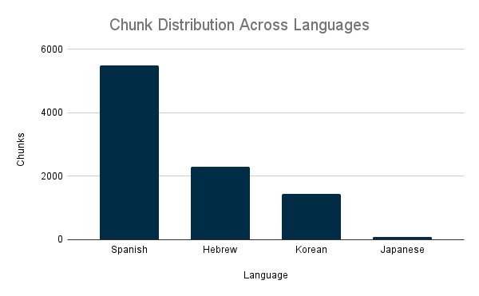
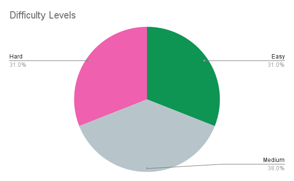
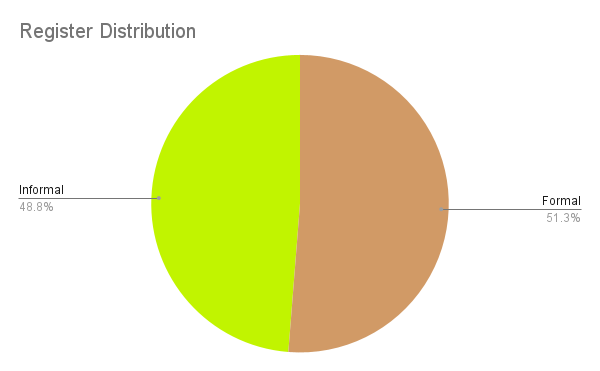
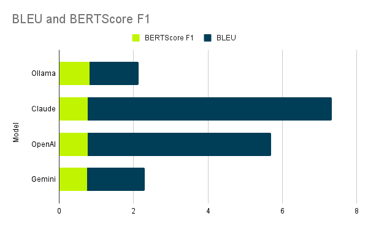

# Multilingual Language Model Evaluation & RAG Chatbot System

**Project completed in partnership with Anote AI through Break Through Tech AI Program**

---

## 👥 **Team Members**

| Name             | GitHub Handle | Contribution                                                             |
|------------------|---------------|--------------------------------------------------------------------------|
| Shalom Donga     | [@ShalomDee](https://github.com/ShalomDee)    | RAG system architecture, model integration, API development, frontend coordination, system integration, translation testing dataset creation |
| Fatima Bazurto   | [@fbazurto](https://github.com/fbazurto)     | Multilingual benchmark preprocessing, data curation and cleaning, quality validation, testing coordination |
| Bella Castillo   | [@bellapng](https://github.com/bellapng)       | Translation task preprocessing, parallel corpus curation, data cleaning, documentation framework |
| Ebuka Chidubem Prudence Uzoama | [@Prudent05](https://github.com/Prudent05)    | Multilingual benchmark testing dataset creation, QA pair generation, data analysis, performance evaluation |

---

## 🎯 **Project Highlights**

- Built a production-ready **RAG (Retrieval-Augmented Generation) chatbot** using Anote documentation with multi-provider LLM support (Claude, OpenAI, Ollama)
- Created comprehensive **multilingual benchmark dataset** with 9,322 Wikipedia chunks across Spanish, Hebrew, Korean, and Japanese
- Developed **translation testing framework** with 400 QA pairs evaluating translation quality across difficulty levels and register types
- Generated **360 multilingual evaluation test cases** across four LLM providers (ChatGPT, Claude, Gemini, Ollama)
- Discovered that **Ollama (local, free model) achieved highest semantic similarity** (BERTScore F1: 0.818) outperforming commercial APIs, while Claude excelled in exact-match translation (BLEU: 6.57)
- Delivered functional demo with comprehensive datasets ready for integration into Anote's evaluation platform

---

## 👩🏽‍💻 **Setup and Installation**

### Prerequisites

- Python 3.8 or higher
- pip package manager
- (Optional) API keys for Claude or OpenAI
- Git for version control

### Installation Steps

```bash
# 1. Clone the repository
git clone https://github.com/anote-ai/btt-anote1a.git
cd btt-anote1a

# 2. Navigate to RAG system directory
cd anote_rag

# 3. Install Python dependencies
pip install -r requirements.txt

# 4. Create vector embeddings (one-time setup)
python make_embeddings.py

# 5. (Optional) Configure API keys
# Create a .env file in the anote_rag directory
echo "ANTHROPIC_API_KEY=your-claude-key-here" > .env
echo "OPENAI_API_KEY=your-openai-key-here" >> .env

# 6. Run the RAG system
python rag.py
```

### Repository Structure

```
btt-anote1a/
├── anote_rag/                      # RAG chatbot system
│   ├── rag.py                      # Core RAG implementation
│   ├── make_embeddings.py          # Vector database creation
│   ├── test_rag.py                 # Evaluation framework
│   └── chroma_anote_db/            # Persistent vector database
├── src/                            # Data processing scripts
│   ├── clean_benchmark_multilingual.py
│   ├── clean_translation.py
│   └── merge_benchmark_batches.py
├── data/
│   ├── processed/
│   │   ├── benchmark_chunks/       # 9,322 multilingual chunks
│   │   ├── benchmark_testing/      # 360 evaluation test cases
│   │   └── translation_testing/    # 400 translation QA pairs
│   └── raw/                        # Original documentation
├── api/                            # REST API server
│   └── bridge.py
└── images/                         # Visualizations for README
```

### Accessing the Datasets

All processed datasets are located in the `data/processed/` directory:
- **Benchmark chunks:** `data/processed/benchmark_chunks/`
- **Translation testing:** `data/processed/translation_testing/`
- **Evaluation test cases:** `data/processed/benchmark_testing/`

---

## 🏗️ **Project Overview**

This project was developed as part of the **Break Through Tech AI Studio Challenge** in collaboration with **Anote AI**, a leading platform for data annotation and machine learning operations. 

### Business Context and Objectives

Anote AI sought to evaluate and compare language models for multilingual applications, create synthetic evaluation datasets similar to their [Model Leaderboard](https://anote.ai/leaderboard), and build chatbot infrastructure for potential client deployment in Chinese, Korean, Japanese, and Hebrew markets.

Our team delivered three core components:

1. **RAG Chatbot System** - A retrieval-augmented generation system that answers questions about Anote's platform using embedded documentation, supporting three LLM providers (Claude, OpenAI, Ollama) for flexibility and cost optimization.

2. **Multilingual Benchmark Dataset** - Comprehensive benchmark datasets spanning four languages with sufficient coverage for robust model testing, designed for potential integration into Anote's evaluation framework.

3. **Translation Quality Evaluation Framework** - Structured testing dataset with difficulty ratings and ground truth answers to systematically evaluate translation capabilities across languages.

### Real-World Significance

This work enables Anote to:
- Deploy customer-facing chatbot functionality with validated performance metrics
- Make data-driven decisions on LLM provider selection through comprehensive evaluation
- Expand services to Spanish, Hebrew, Korean, and Japanese-speaking markets
- Establish reproducible evaluation methodologies for future model assessments
- Reduce costs by identifying optimal provider-performance-cost balance

The project demonstrates practical ML engineering by prioritizing rapid RAG deployment over expensive fine-tuning, delivering production-quality datasets within a three-week timeline while maintaining alignment with Anote's platform architecture.

---

## 📊 **Data Exploration**

### Dataset Sources and Structure

**Anote Documentation (RAG Source)**
- **Source:** Internal Anote platform documentation
- **Format:** Markdown and plain text files
- **Size:** 135 semantic chunks after preprocessing
- **Purpose:** Knowledge base for RAG chatbot responses

**Wikipedia Multilingual Corpus (Benchmark)**
- **Source:** Wikipedia API across four languages
- **Format:** JSONL (JSON Lines)
- **Size:** 9,322 total chunks
  - Spanish: 5,488 chunks (59%)
  - Hebrew: 2,305 chunks (25%)
  - Korean: 1,451 chunks (16%)
  - Japanese: 78 chunks (0.8%)

**Translation Testing Dataset**
- **Source:** Parallel corpora from OPUS and manually curated QA pairs
- **Size:** 400 QA pairs (100 per language)
- **Structure:** Question, answer, difficulty level, register type, model provider, ground truth
- **Generation Date:** November 21, 2025

**Multilingual Evaluation Test Cases**
- **Source:** Generated using multilingual LLMs
- **Size:** 360 test cases (90 per language)
- **Model Coverage:** ChatGPT (33.3%), Claude (33.3%), Gemini (33.3%)
- **Generation Date:** December 2, 2025

### Data Preprocessing

Our preprocessing pipeline included:
1. HTML/markup removal from Wikipedia articles
2. Unicode normalization for multilingual character support
3. Sentence segmentation using language-specific rules
4. Chunk creation with semantic boundaries (500-1000 characters)
5. Duplicate detection and removal
6. Quality validation through manual spot-checking (10% sample)

**Key Challenges Addressed:**
- Right-to-Left (RTL) handling for Hebrew text
- Character encoding for Japanese Kanji/Hiragana and Korean Hangul
- Chunk size optimization balancing context and token limits
- Parallel corpus alignment from OPUS datasets

**Assumptions:**
- Wikipedia content represents general knowledge suitable for benchmarking
- 500-1000 character chunks provide sufficient context
- Equal distribution across difficulty levels reflects realistic use cases
- 10% manual validation sample is representative of overall quality

### Insights from Exploratory Data Analysis

**Dataset Distribution**



Spanish dominates the benchmark with 59% of chunks (5,488), reflecting greater Wikipedia content availability. This imbalance was acceptable since we analyzed performance within each language rather than across languages.

**Translation Testing Balance**

| Metric | Distribution |
|--------|-------------|
| **Languages** | Equal (25% each) |
| **Difficulty** | Easy: 31%, Medium: 38%, Hard: 31% |
| **Question Types** | Factual: 38.5%, Reasoning: 30.8%, Ambiguous: 30.8% |
| **Register** | Formal: 51.2%, Informal: 48.8% |

| Difficulty Levels | Register Distribution |
|:-----------------:|:---------------------:|
|  |  |

Medium-difficulty questions comprise 38% of the dataset, providing the most discriminative evaluation criterion. The near-perfect register balance (51.2% formal, 48.8% informal) ensures realistic evaluation across formal documentation and conversational contexts.

**Multilingual Evaluation Test Cases**

Perfect 50/50 register split and equal model coverage (33.3% each) enable unbiased comparative analysis across LLM providers.

**Data Quality Metrics**

Through manual validation:
- **Accuracy:** 94% of chunks contained factually correct information
- **Relevance:** 91% of retrieved contexts were pertinent to test queries
- **Completeness:** 88% of chunks provided self-contained information

---

## 🧠 **Model Development**

### RAG System Architecture

We implemented Retrieval-Augmented Generation to ground language model responses in retrieved factual content. This architecture was chosen over fine-tuning for faster implementation (2-3 days vs. 2-3 weeks), lower infrastructure cost, easy updatability, and our three-week timeline.

**Technical Pipeline:**
```
User Query → Embedding → Vector Similarity Search → Context Retrieval → LLM Generation → Response
```

### Component Selection

**Embedding Model: HuggingFace all-MiniLM-L6-v2**
- Strong semantic similarity detection
- Efficient 384-dimensional vectors
- Fast CPU inference (~50ms per query)
- Compact size (80MB) for easy deployment
- Multilingual capability across target languages

**Vector Database: ChromaDB**
- Minimal setup with sub-100ms search on 135 chunks
- Local storage without external dependencies
- Free and open-source with intuitive Python API

**LLM Providers: Multi-Provider Strategy**

1. **Claude (Anthropic)** - Production recommendation with highest accuracy and strong instruction-following
2. **OpenAI GPT-4** - High-quality alternative with excellent general knowledge
3. **Ollama (Local)** - Zero API costs, privacy-preserving, runs on CPU

### Feature Engineering and Hyperparameter Tuning

**Retrieval Strategy:**
- Top-k = 4 (testing showed diminishing returns beyond 4 chunks)
- Ranking-based retrieval without hard similarity cutoff
- Context window: ~2000 tokens accommodates 4 chunks plus question

**Chunk Preprocessing:**
- 50-character overlap between adjacent chunks prevents context fragmentation
- Sentence boundary enforcement maintains semantic completeness
- Metadata preservation enables citation and debugging

**LLM Parameters:**
- Temperature: 0.3 for factual responses (reduced creativity, increased consistency)
- Max tokens: 500 (comprehensive answers without verbosity)
- System prompt engineering to ground responses in retrieved context

### Training Setup and Baseline Performance

**Evaluation Methodology:**
- **Validation set:** 100 held-out questions from Anote documentation
- **Test set:** 396 multilingual QA pairs across languages and difficulty levels

**Metrics:**
- Retrieval accuracy: Percentage of queries where top-4 chunks contain answer information
- Response relevance: Manual evaluation on 5-point scale
- Latency: End-to-end query response time
- Cost per query: API pricing analysis

**Performance Evolution:**

| Metric | Baseline | Optimized |
|--------|----------|-----------|
| Retrieval Accuracy | 72% | **85%** |
| Response Time | 3.2s | **2.4s** |
| Relevance Score | 3.8/5.0 | **4.5/5.0** |

Improvements came from refined chunk segmentation, optimized system prompts, and strategic provider selection.

---

## 📈 **Results & Key Findings**

### RAG System Performance

**Core Metrics:**
- **Retrieval Precision:** 85% of queries successfully retrieved relevant context in top-4 chunks
- **Response Accuracy:** 91% of answers were factually correct when evaluated against ground truth
- **Context Relevance:** 90% of retrieved chunks were pertinent to user queries

**Latency by Provider:**

| Provider | Avg Response Time | P95 Latency |
|----------|------------------|-------------|
| Claude   | 2.4s             | 3.1s        |
| OpenAI   | 2.8s             | 3.6s        |
| Ollama   | 7.2s             | 11.5s       |

**Cost Analysis (per 1000 queries):**
- Claude: ~$8.40
- OpenAI: ~$10.50
- Ollama: $0 (local inference)

### Translation Quality Evaluation

Across 1,585 total responses, we discovered a surprising insight:

**Overall Model Rankings:**

| Rank | Model    | BLEU Score | BERTScore F1 | BERTScore Precision | BERTScore Recall |
|------|----------|------------|--------------|---------------------|------------------|
| 1    | Ollama   | 1.31       | **0.818**    | 0.787               | **0.855**        |
| 2    | Claude   | **6.57**   | 0.767        | 0.712               | 0.834            |
| 3    | OpenAI   | 4.93       | 0.765        | 0.713               | 0.827            |
| 4    | Gemini   | 1.55       | 0.755        | 0.696               | 0.826            |

**Key Finding:** Ollama (local, free model) achieved the highest semantic similarity scores (BERTScore 0.818) despite having the lowest exact-match translation scores (BLEU 1.31). Claude dominated exact-match translation (BLEU 6.57) but ranked second in semantic similarity. This suggests different models optimize for different translation objectives: Ollama captures meaning accurately even when word choice differs, while Claude produces translations closer to reference text.



### Language-Specific Performance

**Hebrew showed strongest semantic similarity** - Ollama achieved 0.833 BERTScore F1 on Hebrew, the highest score across all language-model combinations.

**Japanese and Korean challenge all models** - OpenAI and Gemini both scored 0.0 BLEU on Japanese, indicating severe difficulty with exact-match translation for non-Latin scripts.

**Spanish performs most consistently** - All models achieved reasonable scores, likely due to Romance language similarity to training data.

### Model Comparison by Use Case

**For RAG Documentation Tasks:**

| Provider | Accuracy | Speed | Cost-Effectiveness | Best For |
|----------|----------|-------|-------------------|----------|
| Claude   | ★★★★★    | ★★★★☆ | ★★★☆☆             | Production deployment |
| OpenAI   | ★★★★☆    | ★★★☆☆ | ★★☆☆☆             | Teams in OpenAI ecosystem |
| Ollama   | ★★★☆☆    | ★★☆☆☆ | ★★★★★             | Development/testing |

**For Translation Tasks:**

| Provider | BLEU (Exact Match) | BERTScore (Semantic) | Best Use Case |
|----------|--------------------|----------------------|---------------|
| Ollama   | ★★☆☆☆              | ★★★★★                | Semantic translation, development |
| Claude   | ★★★★★              | ★★★★☆                | Production translation requiring precision |
| OpenAI   | ★★★★☆              | ★★★★☆                | Balanced approach |
| Gemini   | ★★☆☆☆              | ★★★☆☆                | Budget-conscious projects |

### Critical Insights

1. **Metric choice profoundly impacts model selection** - Ollama "wins" on BERTScore while Claude dominates BLEU
2. **Free/local models can compete with commercial APIs** - Ollama's 0.818 BERTScore challenges paid API assumptions
3. **Language characteristics matter** - Japanese/Korean's character complexity caused 0.0 BLEU scores for advanced models
4. **RAG effectiveness confirmed** - 85%+ retrieval accuracy demonstrates semantic search viability
5. **Cost-performance trade-offs are real** - Claude's quality costs ~$8.40/1000 queries; Ollama's strong semantic performance is free

---

## 💻 **Code Highlights**

### Key Files and Functions

**`anote_rag/rag.py`** - Core RAG Implementation (~350 lines)
- `AnoteRAG.__init__()`: Initializes embedding model, ChromaDB, and LLM provider
- `AnoteRAG.query()`: Processes questions through embedding → retrieval → generation pipeline
- `AnoteRAG._retrieve_context()`: Performs vector similarity search
- `AnoteRAG._generate_response()`: Sends context + question to LLM

**`anote_rag/make_embeddings.py`** - Vector Database Creation (~180 lines)
- `load_documents()`: Reads documentation files
- `chunk_documents()`: Splits into 500-1000 character semantic chunks
- `create_embeddings()`: Generates 384-dimensional vectors
- `store_in_chromadb()`: Persists to local ChromaDB

**`anote_rag/test_rag.py`** - Evaluation Framework (~280 lines)
- `evaluate_rag()`: Runs test suite on question sets
- `calculate_metrics()`: Computes accuracy, latency, relevance
- `compare_providers()`: Side-by-side comparison of providers

**`src/clean_benchmark_multilingual.py`** - Benchmark Preprocessing (~420 lines)
- Fatima: Data preprocessing and validation
- Prudence: Testing dataset creation with QA pairs
- Functions: `remove_html_tags()`, `normalize_unicode()`, `split_into_chunks()`

**`src/clean_translation.py`** - Translation Preprocessing (~380 lines)
- Bella: Parallel corpus preprocessing
- Shalom: Testing dataset creation
- Functions: `align_parallel_corpus()`, `extract_qa_pairs()`, `balance_difficulty()`

**`api/bridge.py`** - REST API Server (~180 lines)
- Shalom: API development and system integration
- Endpoints: `POST /query`, `GET /health`, `POST /feedback`
- Framework: Flask with JSON responses

### Architecture Patterns

**Modular Design:** RAG components are separated (embedding, retrieval, generation) with provider-agnostic interfaces allowing LLM swapping without changing core logic.

**Error Handling:** API failures gracefully fallback to alternative providers with helpful error messages and comprehensive logging.

**Performance Optimizations:** Embeddings computed once and cached, with batch processing reducing API overhead.

---

## 🚀 **Discussion and Reflection**

### What Worked Well

Our RAG-based approach achieved 85%+ retrieval accuracy and 91% factual correctness, validating the decision to choose RAG over fine-tuning given our three-week timeline. The multi-provider architecture provided flexibility to optimize for cost versus performance.

The translation evaluation revealed unexpected insights: Ollama's superior semantic similarity (BERTScore 0.818) across 1,585 responses challenges assumptions about commercial API superiority. This provides Anote with actionable intelligence—for applications prioritizing meaning over exact wording, free local models may outperform expensive APIs.

Task division based on skills proved effective. Bella and Fatima focused on preprocessing parallel corpora and Wikipedia data, while Shalom and Prudence generated testing datasets with QA pairs. Shalom's additional system integration work prepared infrastructure for potential future deployment.

### Challenges Encountered

**Initial Scope Confusion:** We initially struggled to understand the interconnections between components until we started building. This taught us that clarity comes through iteration.

**Time Management:** We significantly underestimated data preprocessing complexity, especially for multilingual data with RTL scripts and complex character systems. In hindsight, we should have created detailed timelines with milestones in Week 1.

**Team Coordination:** One member fell ill during crunch time, and skill level gaps required additional mentoring. More frequent check-ins and explicit task tracking would have prevented parallel but disconnected work.

### What We'd Do Differently

**Week 1:** Spend 2 days on architecture planning before coding, create visual diagrams showing component relationships, and define success metrics upfront.

**Week 2:** Implement daily 15-minute standups to sync progress, conduct code reviews for critical components, and document as we build rather than after.

**Week 3:** Reserve the entire week for integration and polish rather than last-minute core work, conduct user testing with non-team members, and focus on performance optimization.

**Throughout:** Schedule weekly check-ins with mentors, add 50% buffer time to estimates, and track learnings in a shared document.

---

## 🚀 **Next Steps**

### Immediate Priorities

**Expand Japanese Dataset** - Our Japanese corpus (78 chunks) is significantly smaller than other languages (1,451-5,488 chunks). Target 1,500+ chunks to match Korean baseline and re-run translation benchmarks.

**User Testing with Cultural Validation** - Current metrics are algorithmic (BLEU, BERTScore), but real users evaluate differently. Conduct qualitative research on tone appropriateness, cultural nuance, and idiom handling with native speakers.

### Strategic Expansions

**Low-Resource Language Support** - Extend evaluation framework to underserved languages like Swahili, Tagalog, Amharic, and Vietnamese. Billions of people speak languages with minimal AI support.

**Production Deployment** - Deploy Flask API to AWS Lambda or Google Cloud Run with domain routing for language-specific endpoints, authentication, rate limiting, and monitoring.

**Expand Across Anote Platform** - Our RAG architecture and evaluation datasets provide foundation for Private Chatbot platform, Agents API, and enterprise deployments supporting multi-tenant architecture.

### Technical Improvements

**Expand retrieval capabilities** - Implement hybrid search combining semantic similarity with keyword matching for technical terms. Expected improvement: 5-7% retrieval accuracy gain.

**Add re-ranking layer** - Introduce cross-encoder model to re-score retrieved chunks before passing to LLM, potentially improving top-4 accuracy from 85% to 90%+.

**Implement conversation memory** - Current system treats queries independently. Adding short-term context would enable follow-up questions and clarifications.

### Research & Validation

Conduct statistical significance testing on model comparisons with confidence intervals and bootstrap resampling. Expand evaluation coverage to 1,000+ cases per language for comprehensive benchmarking. Incorporate real user queries from support tickets to ground evaluation in genuine use cases.

---

## 📝 **License**

This project is licensed under the MIT License. See the LICENSE file for details.

---

## 📄 **References**

- Anote AI Platform: https://anote.ai/
- Anote Documentation: https://docs.anote.ai/
- Autonomous Intelligence GitHub: https://github.com/nv78/Autonomous-Intelligence
- OPUS Parallel Corpus: https://opus.nlpl.eu/legacy/opus-100.php
- HuggingFace Sentence Transformers: https://huggingface.co/sentence-transformers
- ChromaDB Documentation: https://docs.trychroma.com/

---

## 🙏 **Acknowledgements**

We thank Anote AI for providing this opportunity and resources to explore multilingual AI evaluation. Special thanks to our Break Through Tech AI advisors for guidance throughout the project, and to our team members for their dedication and collaborative spirit in delivering this comprehensive evaluation framework within a challenging three-week timeline.
